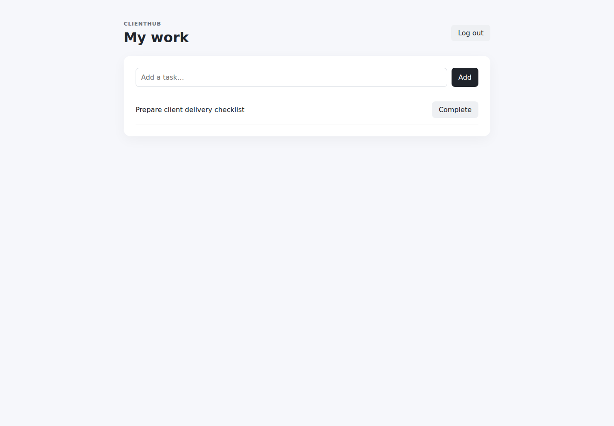

# ClientHub

A React + TypeScript workspace for keeping a small team's work organized. The UI consumes the **TaskForge NestJS API** and deliberately uses the same REST contract as the Vue WorkBoard client.

## What it demonstrates

- React 18 + TypeScript + Vite
- Authentication and registration flow
- Bearer-token API integration
- Task loading, creation, completion, and logout
- Loading, empty, validation, and error states
- Responsive UI
- Vitest tests
- GitHub Actions test/build verification

## Architecture

```
React 18 / TypeScript
        |
        | REST + Bearer token
        v
TaskForge API (NestJS)
        |
        v
PostgreSQL
```

The backend is intentionally shared with the other frontend client. This repository focuses on React implementation rather than creating a second copy of the API.

## Run locally

```bash
npm install
npm run dev
```

Set `VITE_API_URL` when the API is not available at `http://localhost:3000/api`.

Checks:

```bash
npm test
npm run build
```

## Screenshots

These are captured from the **running React + NestJS + PostgreSQL stack in GitHub Actions using Playwright**.

### Task created

A real account creates a task through the React UI and the NestJS API.



### Task completed

The same task is then completed through the UI and persisted through the API.


The CI pipeline runs the frontend tests/build, starts the real TaskForge API with PostgreSQL, executes the browser flow, and stores the screenshots as an artifact.

## Why a separate React project?

WorkBoard demonstrates the Vue implementation of the same API contract. ClientHub demonstrates that I can move between React and Vue while keeping backend boundaries and behavior consistent.
