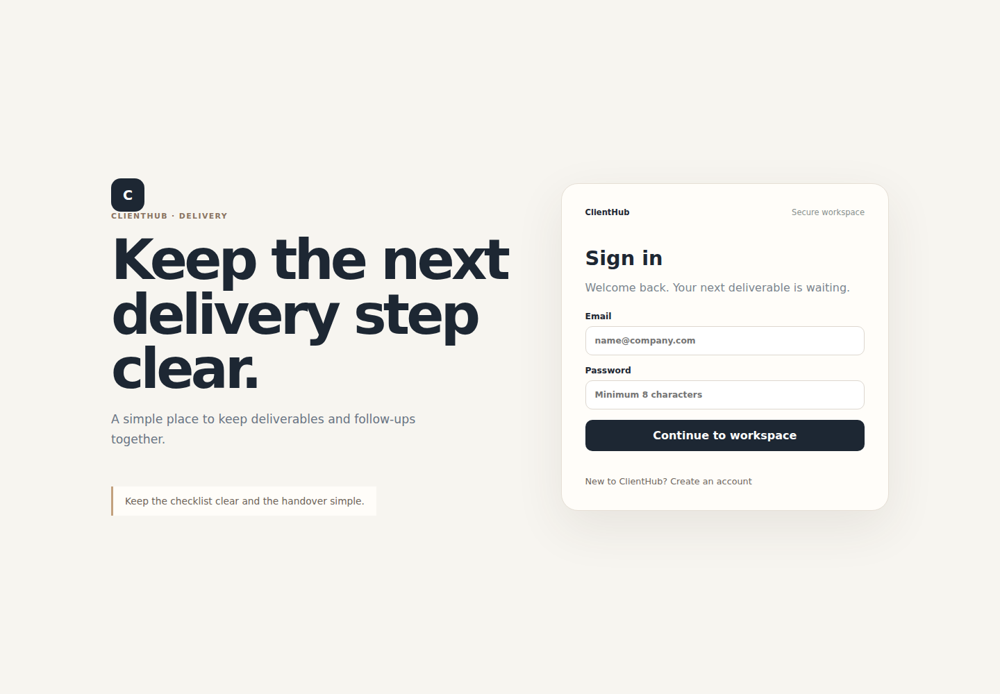
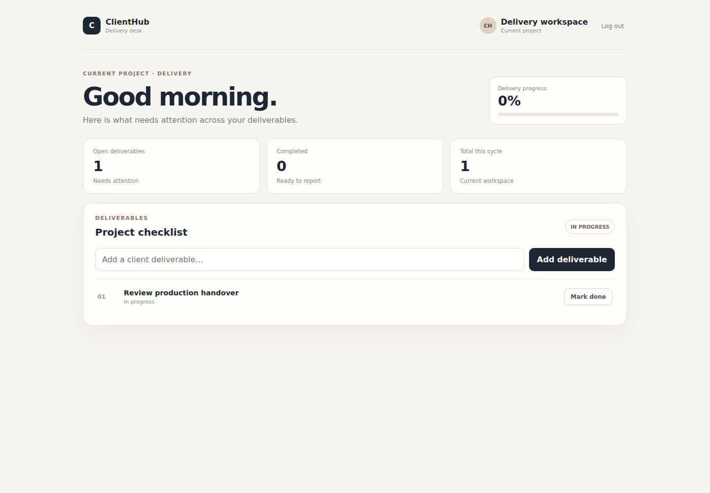
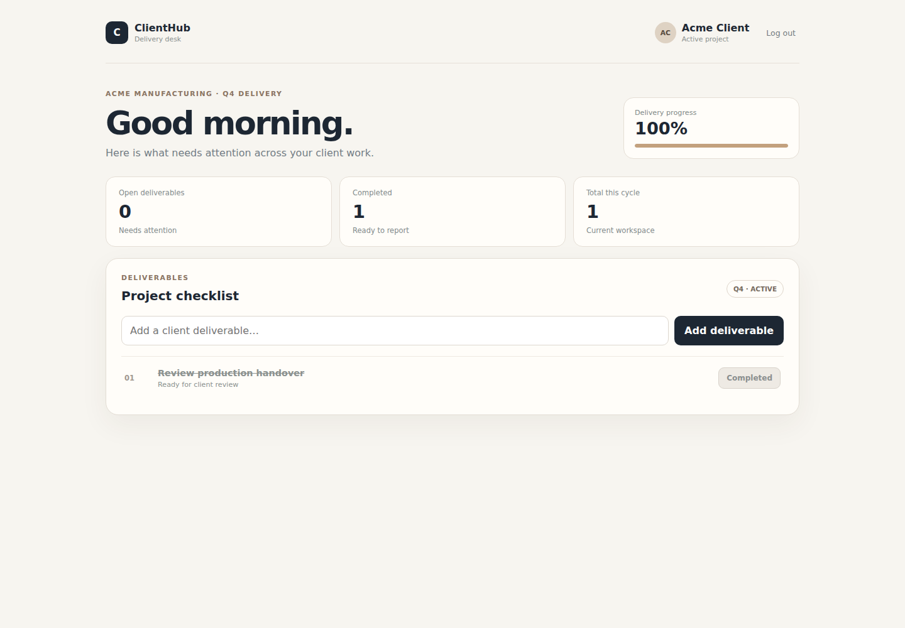

# ClientHub

A React workspace for keeping track of client deliverables and their progress.

ClientHub uses the same TaskForge API as WorkBoard, but the UI is built around a different use case: client/project delivery rather than a personal task list.

## Stack

- React 18
- TypeScript
- Vite
- Vitest
- Testing Library

## What I built

- Sign in and account creation
- Authenticated client workspace
- Client/project context
- Add and complete deliverables
- Delivery progress and project metrics
- Loading, empty and error states
- Responsive layout
- Bearer-token API integration

## Run locally

Start TaskForge API on `http://localhost:3000/api`, then:

```bash
npm install
npm run dev
```

Tests and production build:

```bash
npm test
npm run build
```

## Screenshots

These are browser captures from the application running against the API and PostgreSQL database in GitHub Actions.

### Sign in


### Create an account


### Add a deliverable


### Complete a deliverable


## Why React?

ClientHub is the React implementation of the workflow. WorkBoard implements the same backend contract in Vue.
